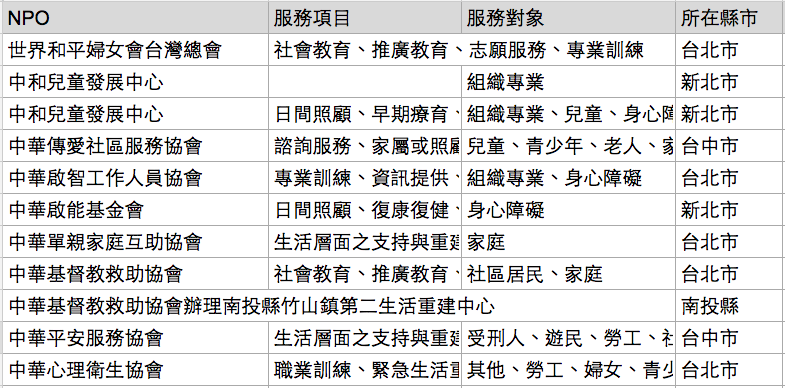
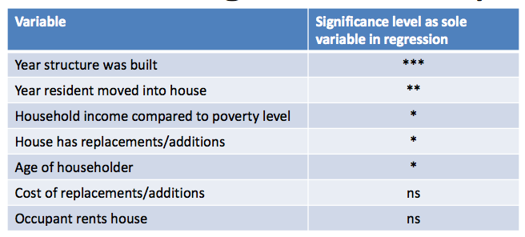

## About Me {.columns-2}
```{r setup, include=FALSE, cache=FALSE}
library(knitr)
library(magrittr)
library(xtable)
library(dplyr)
library(ggplot2)
opts_chunk$set(echo = FALSE, cache=TRUE, comment="", cache.path = ".cache-EDA/")
fig <- function(path, size = 100) {
  sprintf("</img>", 
          path, size, size)
}
fig2 <- function(path, size = 100) {
  sprintf("</img>", 
          path, size)
}
sys_name <- Sys.info()["sysname"] %>% tolower
sys_encode <- c("utf8", "utf8", "big5")[pmatch(sys_name, c("linux", "darwin", "windows"))]
sessionInfo() %>% capture.output %>% cat(file = "sessionInfo.log", sep = "\n")
```
### 谢宗震 博士 (Johnson Hsieh)
- R语言年资 9年
- 新竹清华统计 博士 (2009 - 2013)
- **DSP智库驱动** 知识长 (dsp.im)
- 台北市公参会**开放资料组** 顾问
- R package: `iNEXT`, `CARE1`, `JADE`, `SpadeR`, `iNextPD` ...


- DataScience HC group 共同创办人
- Taiwan R User group officer
- Data for social good 共同创办人

<br>
<p>
<br>

`r fig("johnson.jpg")`
<br>
<font size="2">
擅长跨与领域专家合作，开发的R包iNEXT被应用于生物、遗传、新闻、文学、电竞等领域。现职为DSP智库驱动知识长，辅导超过300位企业人士成为数据分析人才。
</font>

## {.vcentered .centered}

<p>
<br>
<p style="font-size: 180%"> 参与这场R语言会议的朋友有福了 </p>
<br>
<p style="font-size: 180%">
 这场演讲将分享用R做开放数据分析的真实经验
</p>
<br>
<p style="font-size: 180%">
所有案例原始数据、代原码都公开在github </p>


## Agenda

<ul style="font-size: 120%">
<li>Real world, data and open data</li>
<li>Three types of data analysis</li>
<li>Discussion and case study</li>
</ul>

# About Data

## About Data {.smaller .centered}
</img>
<h3>Real World, All Data, Big Data, Open Data</h3>
取自 <http://goo.gl/HS4irZ>


## Open Data
开放数据是一种经过挑选与许可的数据，它不受著作权、专利权，以及其他管理机制所限制，可以开放给社会公众，任何人都可以自由出版使用，不论是要拿来出版或是做其他的运用都不加以限制。

<br>
<ul style="font-size: 120%">
<li>资讯对称，沟通透明</li>
<li>群众外包，共同参与</li>
<li>练功打怪，自我实现</li>
<li>结合创新，提升效能</li>
</ul>

# Three types of data analysis

## Three types of data analysis
<h3> 掌握现况 </h3>
<h3> 洞悉关联 </h3>
<h3> 预测未知 </h3>

# 掌握现况案例


## 社区医疗群地图 (gov) {.smaller .centered}
</img>
<h3>ggmap + rCharts + shiny</h3>
作者： 李昕迪 医师 (mcdlee)

## 社区医疗群地图 (gov) {.smaller .centered}
<iframe src="http://mcdlee.github.io/VGHKS/VGHKS.html" width="960" height="400" scrolling="yes" frameborder="0"> 
</iframe> 

## 社区医疗群地图 (gov)
- 来源：卫福部中央健保署
- 作者：李昕迪 医师 (mcdlee)
- R包：`ggmap` + `rCharts` + `shiny`
- 参考: [slide](http://mcdlee.github.io/gisVisualization), [shinypp](https://mcdlee.shinyapps.io/communitymedcare), [github repo](https://github.com/mcdlee/communitymedcare)

## NPO城乡多样性比较 (NPO) {.smaller .centered}
</img>
<h3>联合劝募基金会</h3>
https://www.unitedway.org.tw/

## NPO城乡多样性比较 (NPO) {.smaller .centered}
</img>
<h3>利用`rvest`爬NPO名录</h3>
收录1111间NPO，包含16种服务对象(tag)

## NPO城乡多样性比较 (NPO) {.smaller .centered}
</img>
<h3>`dplyr` + `ggplot2`</h3>
台北 (都市, S=16, n=738)、云嘉 (农业, S=15, n=177)、花东 (偏乡, S=15, n=206)

## NPO城乡多样性比较 (NPO)  {.columns-2}
- 多样性 (diversity) 与多样性指标
- 一个区域的多样性越高，表示遇到灾害的容忍程度越高
- 基本概念：种类越多越好，分布越均匀越好
- Shannon diversity: $H = \exp{\left ( \sum_{i=1}^{S}-p_i\log{p_i}\right )}$
<br>
<p>
<br>
</img>


## NPO城乡多样性比较 (NPO)
- 多样性指标会受到样本数所影响，样本数越大，能够观察到的种类数也越多，多样性就越大。为求公平，应控制在相同样本数下比较多样性。
- Shannon diversity: $H(n) = \exp{\left ( \sum_{i=1}^{S}-p_i(n)\log{p_i(n)}\right )}$
<br>
```{r eval=FALSE, echo=TRUE}
install.packages("iNEXT") # 安装 iNEXT package (Hsieh et al. , 2015) 
library(iNEXT)
tab <- read.csv("npo-type.csv", row.names = 1)
# iNEXT 主程式，计算位阶数q = 1的Shannon diversity 稀释/外插估计
out <- iNEXT(tab, q=1, endpoint=750, se=FALSE)
# 整合ggplot2绘图风格
ggiNEXT(out) + 
  theme_gray(base_family = "STHeiti")
```

## NPO城乡多样性比较 (NPO) {.smaller .centered}
</img>
<h3>`dplyr` + `ggplot2` + `iNEXT`</h3>
多样性排序：花东 > 台北 > 云嘉

## NPO城乡多样性比较 (NPO)
- 来源：联合劝募基金会
- 作者：谢宗震 博士 (Johnson)
- R包：`dplyr` + `ggplot` + `iNEXT`
- 参考:  [shinypp](https://chao.shinyapps.io/iNEXT), [github repo](https://github.com/JohnsonHsieh/iNEXT)
- 

# 洞悉因素案例

## 找出火灾风险热区 (GOV) {.smaller .centered}
</img>
<h3>纽奥良消防局 +  Nolalytics</h3>
火灾风险热区 (优先发放烟雾警报器)

## 找出火灾风险热区 (GOV) {.smaller .centered}
</img>
<h3>回归分析：找出影响火灾的因子</h3>
屋龄、居住时间、收入水平、更新、屋主年龄、租/住

## 找出火灾风险热区 (GOV)
- 来源：纽奥良消防局
- 作者：Nolalytics (New Orleans Analytics)
- R包：`reshape` + `plyr` + `dplyr`+ `ROCR` + `maps` + `maptools` + `sp` + `rgdal`
- Reference: [github repo](https://github.com/cno-opa/smoke-alarm-outreach), [report](http://nola.gov/performance-and-accountability/nolalytics/files/full-report-on-analytics-informed-smoke-alarm-outr/)

# 预测未知案例

##  {.smaller .centered}
</img>

##  {.smaller .centered}
</img>

## 豪宅房价预测 (GOV)
- 内政部实价登录资料 (2012年8月 ~ 2013年9月)
- 顶级豪宅：40 / 21530 件
- 重要因子：面积、车位、屋龄、行政区、楼层
- `reshape` + `dplyr` + `mgcv`
```{r echo=TRUE, message=FALSE, warning=FALSE}
library(mgcv) #provides functions for generalized additive modelling
dat1 <- readRDS("data/dat1.rds")
# fit linear model
g1 <- lm(log10(總價)~面積+車位+屋齡+行政區+floor, data=dat1)
# fit addiive model with two smooth terms
g2 <- gam(log10(總價)~s(面積)+車位+s(屋齡)+行政區+floor, data=dat1)
# Compare adjusted R-squared, 越趨近1模型配適度越好
data.frame("linear model"=summary(g1)$adj.r.sq, "additive model"=summary(g2)$r.sq)
```

## 豪宅房价预测 (GOV) {.smaller .centered}
</img>

## 豪宅房价预测 (GOV)
```{r echo=TRUE, eval=FALSE}
# set dataset, 帝寶格局
new <- dat1[1:6, c(2,3,4,6,7,12)]
rownames(new) <- 1:6
new$面積 <- c(160,160,210,210,260,260)
new$車位 <- rep("有車位",6); 
new$屋齡 <- rep(8, 6)
new$行政區 <- rep("大安區",6)
new$floor <- rep(c("低樓層","高樓層"),3)
# prediction
tmp <- predict(g2, newdata=new, se.fit=TRUE)
pred <- 10^cbind(tmp$fit, tmp$fit-tmp$se.fit, tmp$fit+tmp$se.fit)
data.frame("建案坪數"=new$面積, "高低樓層"=new$floor, 
           "總價估計.萬元"=round(pred[,1]/10000),
           "單價估計.萬元"=round(pred[,1]/10000/new$面積))
```

## 豪宅房价预测 (GOV) {.smaller .centered}
</img>

## 豪宅房价预测 (GOV){.smaller .centered}
</img>

## 豪宅房价预测 (GOV)
- 来源：内政部实价登录资料 (2012年8月 ~ 2013年9月)
- 作者：谢宗震 博士
- R包：`mgcv`
- Reference: [github repo](https://github.com/JohnsonHsieh/study-area-statR)


## NPO总数估计 (NPO){.smaller .centered}
</img>
<br>
四种来源：台湾公益资讯中心、善耕365、联合劝募、自律联盟

## NPO总数估计 (NPO){.smaller .centered}
</img>
<h3>重复捕取方法 (Chao et al. 2015)</h3>

## NPO总数估计 (NPO)
```{r echo=TRUE, eval=FALSE}
install.packages("CARE1") # 样本覆盖率估计法 (Chao et al. 2015)
library(CARE1)
npoList <- read.csv("data/npoList.csv", row.names=1)
record <- as.record(npoList)
estN.stat(record) 
# M=观察到的总类别, D=任两来源的平均类别, C=样本覆盖率
estN(record, method="LSC", se=TRUE)
# 四个来源共观察到 3528间 NPO，以样本覆盖率法推得 7507间 NPO估计值
```
```{r }
library(CARE1)
npoList <- read.csv("data/npoList.csv", row.names=1)
record <- as.record(npoList)
record
estN.stat(record) 
# M=种类别, D=任两来源的平均类别, C=样本覆盖率
estN(record, method="LSC", se=TRUE)
```

## NPO总数估计 (NPO)
- 来源：台湾公益资讯中心、善耕365、联合劝募、自律联盟
- 作者：DSP资料科学团队
- R包：`rvest` + `CARE1` + `shiny`
- 参考: [hackpad](https://dsp.hackpad.com/-NPO-WcWRyZSZFge), [hackathon](http://hack.dsp.im/d4sg-hackathon/https%253A%252F%252Fgoo.gl%252FPFEpD2)


## 博客浏览数预测 (Business)  {.smaller .centered}
</img>

##  数据竞赛平台 {.smaller .centered}
</img>


## 数据竞赛平台  {.smaller .centered}
</img>
<h3>数据竞赛平台</h3>
政府、企业、非营利组织的数据加值平台

## Summary
- 社区医疗群地图: https://github.com/mcdlee/communitymedcare
- NPO城乡多样性比: https://github.com/JohnsonHsieh/iNEXT
- 找出火灾风险热区: https://github.com/cno-opa/smoke-alarm-outreach
- 豪宅房价预测: https://github.com/JohnsonHsieh/study-area-statR
- NPO总数估计: https://dsp.hackpad.com/-NPO-WcWRyZSZFge

# Thank You