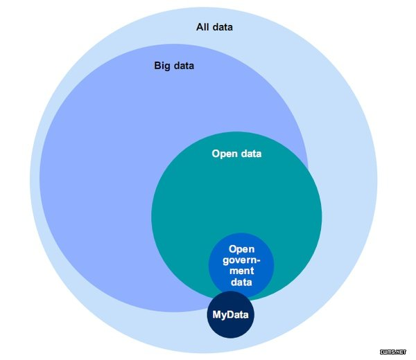
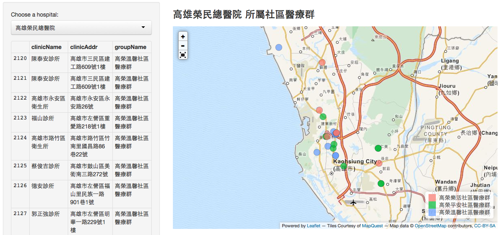
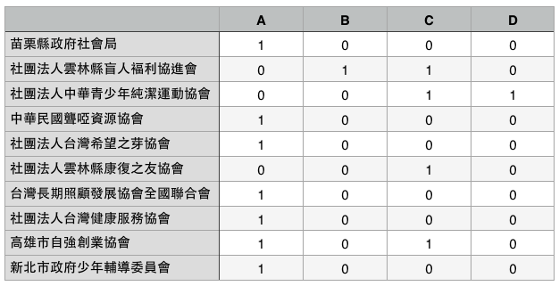

## About Me {.columns-2}
```{r setup, include=FALSE, cache=FALSE}
library(knitr)
library(magrittr)
library(xtable)
library(dplyr)
library(ggplot2)
opts_chunk$set(echo = FALSE, cache=TRUE, comment="", cache.path = ".cache-EDA/")
fig <- function(path, size = 100) {
  sprintf("</img>", 
          path, size, size)
}
fig2 <- function(path, size = 100) {
  sprintf("</img>", 
          path, size)
}
sys_name <- Sys.info()["sysname"] %>% tolower
sys_encode <- c("utf8", "utf8", "big5")[pmatch(sys_name, c("linux", "darwin", "windows"))]
sessionInfo() %>% capture.output %>% cat(file = "sessionInfo.log", sep = "\n")
```
### 謝宗震 博士 (Johnson Hsieh)
- R語言年資 9年
- 新竹清華統計 博士 (2009 - 2013)
- **DSP智庫驅動** 知識長 (dsp.im)
- 台北市公參會**開放資料組** 顧問
- R package: `iNEXT`, `CARE1`, `JADE`, `SpadeR`, `iNextPD` ...


- DataScience HC group 共同創辦人
- Taiwan R User group officer
- Data for social good 共同創辦人

<br>
<p>
<br>

`r fig("johnson.jpg")`
<br>
<font size="2">
擅長跨與領域專家合作，開發的R包iNEXT被應用於生物、遺傳、新聞、文學、電競等領域。現職為DSP智庫驅動知識長，輔導超過300位企業人士成為數據分析人才。
</font>

## {.vcentered .centered}

<p>
<br>
<p style="font-size: 180%"> 參與這場R語言會議的朋友有福了 </p>
<br>
<p style="font-size: 180%">
 這場演講將分享用R做開放數據分析的真實經驗
</p>
<br>
<p style="font-size: 180%">
所有案例原始數據、代原碼都公開在github </p>


## Agenda

<ul style="font-size: 120%">
<li>Real world, data and open data</li>
<li>Three types of data analysis</li>
<li>Discussion and case study</li>
</ul>

# About Data

## About Data {.smaller .centered}
</img>
<h3>Real World, All Data, Big Data, Open Data</h3>
取自 <http://goo.gl/HS4irZ>


## Open Data
開放數據是一種經過挑選與許可的數據，它不受著作權、專利權，以及其他管理機制所限制，可以開放給社會公眾，任何人都可以自由出版使用，不論是要拿來出版或是做其他的運用都不加以限制。

<br>
<ul style="font-size: 120%">
<li>資訊對稱，溝通透明</li>
<li>群眾外包，共同參與</li>
<li>練功打怪，自我實現</li>
<li>結合創新，提升效能</li>
</ul>

# Three types of data analysis

## Three types of data analysis
<h3> 掌握現況 </h3>
<h3> 洞悉關聯 </h3>
<h3> 預測未知 </h3>

# 掌握現況案例


## 社區醫療群地圖 (gov) {.smaller .centered}
</img>
<h3>ggmap + rCharts + shiny</h3>
作者： 李昕迪 醫師 (mcdlee)

## 社區醫療群地圖 (gov) {.smaller .centered}
<iframe src="http://mcdlee.github.io/VGHKS/VGHKS.html" width="960" height="400" scrolling="yes" frameborder="0"> 
</iframe> 

## 社區醫療群地圖 (gov)
- 來源：衛福部中央健保署
- 作者：李昕迪 醫師 (mcdlee)
- R包：`ggmap` + `rCharts` + `shiny`
- 參考: [slide](http://mcdlee.github.io/gisVisualization), [shinypp](https://mcdlee.shinyapps.io/communitymedcare), [github repo](https://github.com/mcdlee/communitymedcare)

## NPO城鄉多樣性比較 (NPO) {.smaller .centered}
</img>
<h3>聯合勸募基金會</h3>
https://www.unitedway.org.tw/

## NPO城鄉多樣性比較 (NPO) {.smaller .centered}
</img>
<h3>利用`rvest`爬NPO名錄</h3>
收錄1111間NPO，包含16種服務對象(tag)

## NPO城鄉多樣性比較 (NPO) {.smaller .centered}
</img>
<h3>`dplyr` + `ggplot2`</h3>
台北 (都市, S=16, n=738)、雲嘉 (農業, S=15, n=177)、花東 (偏鄉, S=15, n=206)

## NPO城鄉多樣性比較 (NPO)  {.columns-2}
- 多樣性 (diversity) 與多樣性指標
- 一個區域的多樣性越高，表示遇到災害的容忍程度越高
- 基本概念：種類越多越好，分布越均勻越好
- Shannon diversity: $H = \exp{\left ( \sum_{i=1}^{S}-p_i\log{p_i}\right )}$
<br>
<p>
<br>
</img>


## NPO城鄉多樣性比較 (NPO)
- 多樣性指標會受到樣本數所影響，樣本數越大，能夠觀察到的種類數也越多，多樣性就越大。為求公平，應控制在相同樣本數下比較多樣性。
- Shannon diversity: $H(n) = \exp{\left ( \sum_{i=1}^{S}-p_i(n)\log{p_i(n)}\right )}$
<br>
```{r eval=FALSE, echo=TRUE}
install.packages("iNEXT") # 安裝 iNEXT package (Hsieh et al. , 2015) 
library(iNEXT)
tab <- read.csv("npo-type.csv", row.names = 1)
# iNEXT 主程式，計算位階數q = 1的Shannon diversity 稀釋/外插估計
out <- iNEXT(tab, q=1, endpoint=750, se=FALSE)
# 整合ggplot2繪圖風格
ggiNEXT(out) + 
  theme_gray(base_family = "STHeiti")
```

## NPO城鄉多樣性比較 (NPO) {.smaller .centered}
</img>
<h3>`dplyr` + `ggplot2` + `iNEXT`</h3>
多樣性排序：花東 > 台北 > 雲嘉

## NPO城鄉多樣性比較 (NPO)
- 來源：聯合勸募基金會
- 作者：謝宗震 博士 (Johnson)
- R包：`dplyr` + `ggplot` + `iNEXT`
- 參考:  [shinypp](https://chao.shinyapps.io/iNEXT), [github repo](https://github.com/JohnsonHsieh/iNEXT)
- 

# 洞悉因素案例

## 找出火災風險熱區 (GOV) {.smaller .centered}
</img>
<h3>紐奧良消防局 +  Nolalytics</h3>
火災風險熱區 (優先發放煙霧警報器)

## 找出火災風險熱區 (GOV) {.smaller .centered}
</img>
<h3>回歸分析：找出影響火災的因子</h3>
屋齡、居住時間、收入水平、更新、屋主年齡、租/住

## 找出火災風險熱區 (GOV)
- 來源：紐奧良消防局
- 作者：Nolalytics (New Orleans Analytics)
- R包：`reshape` + `plyr` + `dplyr`+ `ROCR` + `maps` + `maptools` + `sp` + `rgdal`
- Reference: [github repo](https://github.com/cno-opa/smoke-alarm-outreach), [report](http://nola.gov/performance-and-accountability/nolalytics/files/full-report-on-analytics-informed-smoke-alarm-outr/)

# 預測未知案例

##  {.smaller .centered}
</img>

##  {.smaller .centered}
</img>

## 豪宅房價預測 (GOV)
- 內政部實價登錄資料 (2012年8月 ~ 2013年9月)
- 頂級豪宅：40 / 21530 件
- 重要因子：面積、車位、屋齡、行政區、樓層
- `reshape` + `dplyr` + `mgcv`
```{r echo=TRUE, message=FALSE, warning=FALSE}
library(mgcv) #provides functions for generalized additive modelling
dat1 <- readRDS("data/dat1.rds")
# fit linear model
g1 <- lm(log10(總價)~面積+車位+屋齡+行政區+floor, data=dat1)
# fit addiive model with two smooth terms
g2 <- gam(log10(總價)~s(面積)+車位+s(屋齡)+行政區+floor, data=dat1)
# Compare adjusted R-squared, 越趨近1模型配適度越好
data.frame("linear model"=summary(g1)$adj.r.sq, "additive model"=summary(g2)$r.sq)
```

## 豪宅房價預測 (GOV) {.smaller .centered}
</img>

## 豪宅房價預測 (GOV)
```{r echo=TRUE, eval=FALSE}
# set dataset, 帝寶格局
new <- dat1[1:6, c(2,3,4,6,7,12)]
rownames(new) <- 1:6
new$面積 <- c(160,160,210,210,260,260)
new$車位 <- rep("有車位",6); 
new$屋齡 <- rep(8, 6)
new$行政區 <- rep("大安區",6)
new$floor <- rep(c("低樓層","高樓層"),3)
# prediction
tmp <- predict(g2, newdata=new, se.fit=TRUE)
pred <- 10^cbind(tmp$fit, tmp$fit-tmp$se.fit, tmp$fit+tmp$se.fit)
data.frame("建案坪數"=new$面積, "高低樓層"=new$floor, 
           "總價估計.萬元"=round(pred[,1]/10000),
           "單價估計.萬元"=round(pred[,1]/10000/new$面積))
```

## 豪宅房價預測 (GOV) {.smaller .centered}
</img>

## 豪宅房價預測 (GOV){.smaller .centered}
</img>

## 豪宅房價預測 (GOV)
- 來源：內政部實價登錄資料 (2012年8月 ~ 2013年9月)
- 作者：謝宗震 博士
- R包：`mgcv`
- Reference: [github repo](https://github.com/JohnsonHsieh/study-area-statR)


## NPO總數估計 (NPO){.smaller .centered}
</img>
<br>
四種來源：台灣公益資訊中心、善耕365、聯合勸募、自律聯盟

## NPO總數估計 (NPO){.smaller .centered}
</img>
<h3>重復捕取方法 (Chao et al. 2015)</h3>

## NPO總數估計 (NPO)
```{r echo=TRUE, eval=FALSE}
install.packages("CARE1") # 樣本覆蓋率估計法 (Chao et al. 2015)
library(CARE1)
npoList <- read.csv("data/npoList.csv", row.names=1)
record <- as.record(npoList)
estN.stat(record) 
# M=觀察到的總類別, D=任兩來源的平均類別, C=樣本覆蓋率
estN(record, method="LSC", se=TRUE)
# 四個來源共觀察到 3528間 NPO，以樣本覆蓋率法推得 7507間 NPO估計值
```
```{r }
library(CARE1)
npoList <- read.csv("data/npoList.csv", row.names=1)
record <- as.record(npoList)
record
estN.stat(record) 
# M=種類別, D=任兩來源的平均類別, C=樣本覆蓋率
estN(record, method="LSC", se=TRUE)
```

## NPO總數估計 (NPO)
- 來源：台灣公益資訊中心、善耕365、聯合勸募、自律聯盟
- 作者：DSP資料科學團隊
- R包：`rvest` + `CARE1` + `shiny`
- 參考: [hackpad](https://dsp.hackpad.com/-NPO-WcWRyZSZFge), [hackathon](http://hack.dsp.im/d4sg-hackathon/https%253A%252F%252Fgoo.gl%252FPFEpD2)


## 博客瀏覽數預測 (Business)  {.smaller .centered}
</img>

##  數據競賽平台 {.smaller .centered}
</img>


## 數據競賽平台  {.smaller .centered}
</img>
<h3>數據競賽平台</h3>
政府、企業、非營利組織的數據加值平台

## Summary
- 社區醫療群地圖: https://github.com/mcdlee/communitymedcare
- NPO城鄉多樣性比: https://github.com/JohnsonHsieh/iNEXT
- 找出火災風險熱區: https://github.com/cno-opa/smoke-alarm-outreach
- 豪宅房價預測: https://github.com/JohnsonHsieh/study-area-statR
- NPO總數估計: https://dsp.hackpad.com/-NPO-WcWRyZSZFge

# Thank You